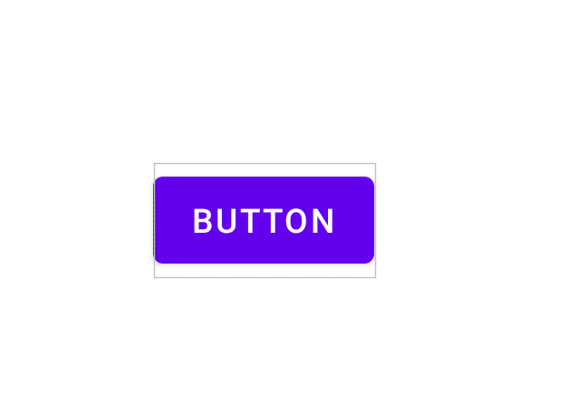

- setContent (Activity ↔ UI 연결)

    - 형식

    - Activity 실행 → setContent → Composable 실행 → 화면 출력

```kotlin
setContent {
    MyScreen()
}
```
---

- Text (기본 UI 출력)  

    - 주요 파라미터

        text → 내용

        fontSize → 크기

        color → 색상
    
    - 형식


```kotlin
Text(
    text = "안녕하세요",
    fontSize = 20.sp
)
```
- Column / Row / Box

```kotlin
// 세로
Column {
    Text("A")
    Text("B")
} /* 결과
A
B */

// 가로
Row {
    Text("A")
    Text("B")
} // 결과 : A B

//겹치기
Box {
    Text("A")
    Text("B")
}
```
---
- Modifier (진짜 중요, 실무 핵심)
    - ___UI 꾸미기 / 배치 / 크기 조절___
    - 형식
```kotlin 
Text(
    "Hello",
    modifier = Modifier
        .padding(16.dp)
        .background(Color.Gray)
)
``` 
---

- Button (이벤트 처리)
    - 형식
```kotlin
Button(onClick = { 
    println("클릭됨")
}) {
    Text("버튼")
}
```

-> onClick : 버튼 클릭 시 실행

-> enabled : 클릭 가능 / 불가능 상태, boolean

-> colors : 색상 변경

예)
```kotlin
Button(
    onClick = { }, // 클릭 이벤트 있지만 동작X
    colors = ButtonDefaults.buttonColors()
) {
    Text("색상 버튼")
}
```
