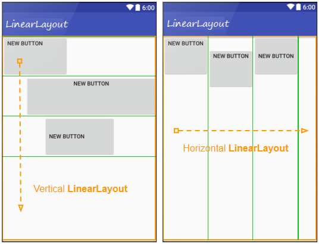
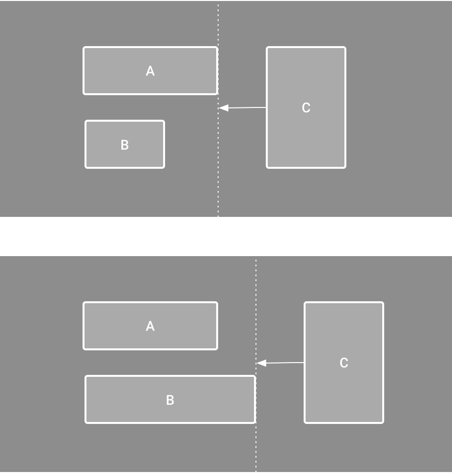
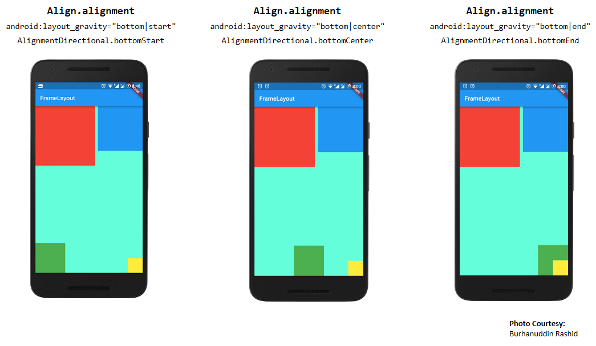

> ## UI

- view : UI 의 기본단위 
    - 버튼 하나, 텍스트 하나 = View

- ViewGroup : UI 컨테이너 역할을 하는 클래스(부모 - 자식 관계)

     -> android.view.ViewGroup
    
    - 형식

```kotlin
LinearLayout {
    Text("A")
    Button(...)
}
```
---
### 위젯 (wiget) 
- view를 상속한 클래스

---

### 레이아웃(layout) 
- viewgroup을 상속한 클래스
    - viewgroup은 view 상속
- view를 배치함

### ___대표종류___
- LinearLayout (일렬 배치)



---

- __ConstraintLayout__ : 위치를 “제약조건”으로 설정

->
"버튼을 부모의 왼쪽에 붙여라”
“이 텍스트를 버튼 위에 놓아라”
“이 이미지의 오른쪽에 텍스트를 배치해라”

___기준점을 잡아서 위치를 정하는 방식___


---
- FrameLayout : 겹쳐서 화면 위에 화면 올려놓음



---
> ### 요약
  
```
View
 └── ViewGroup
       ├── Layout 계열
       │     ├── LinearLayout
       │     ├── ConstraintLayout
       │     └── FrameLayout
       └── 다른 ViewGroup들...
```
---
---
---
> ### Composable 함수(UI를 그리는 함수)

- __@Composable 어노테이션이 붙음__
    - 거의 무조건 ui은 붙혀야 함
- 상태가 바뀌면 자동으로 다시 실행됨 (Recomposition) 
```kotlin 
@Composable
fun A() { }
```

- Composable 안에서만 Composable 호출 가능

```kotlin
@Composable
fun A() {
    B() // 가능
}

@Composable
fun B() {
    Text("hi")
}
```

---

> ## compose 
- coposable 함수로 ui를 만드는 방법